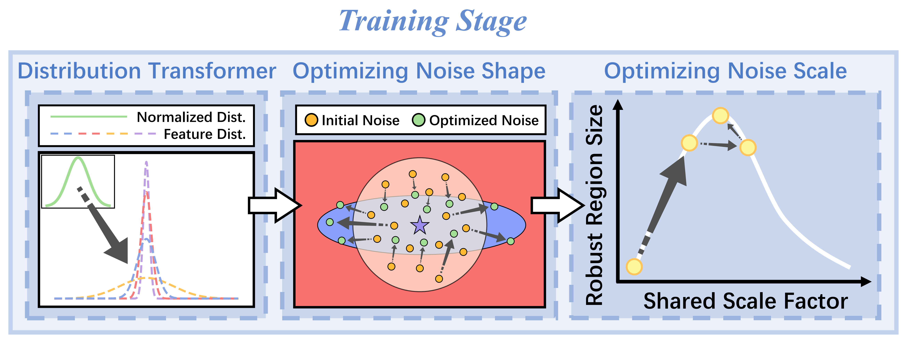
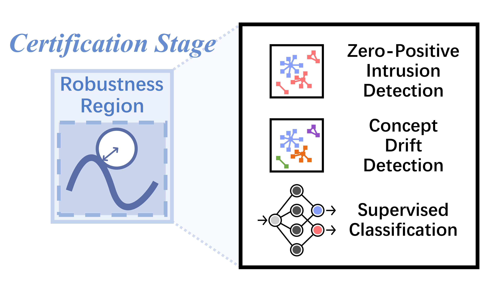

# BARS: Local Robustness Certification for Traffic Analysis

> *BARS: Local Robustness Certification for Deep Learning based Traffic Analysis Systems (NDSS'23)*

## Introduction

**BARS** is a general local robustness certification framework for Deep Learning (DL) based traffic analysis systems based on **B**oundary **A**daptive **R**andomized **S**moothing. Against adversarial perturbations, local robustness certification is used to certify whether a DL-based model is robust in the neighborhood of a sample.

**BARS** optimizes the smoothing noise of randomized smoothing and provide tighter robustness guarantee for the traffic analysis domain. The pipeline includes four steps:
- [Build Distribution Transformer.](bars/distribution_transformer.py)
- [Optimize the noise shape.](bars/optimizing_noise.py)
- [Optimize the noise scale.](bars/optimizing_noise.py)
- [Certify robustness.](bars/smoothing.py)

**BARS** supports three traffic analysis systems:
- [Zero-Positive  Network Intrusion Detection System, Kitsune (NDSS'18)](smoothed_kitsune)
- [Concept Drift Detection System, CADE (USENIX Security'21)](smoothed_cade)
- [Supervised Multi-Classification System, ACID (INFOCOM'21)](smoothed_acid)

## Quick Start

### 1. Environmental Setup

- Basic **BARS**: `pip install -r requirement_bars.txt`
- Smoothed Kitsune: `pip install -r requirement_kitsune.txt`
- Smoothed CADE: `pip install -r requirement_cade.txt`
- Smoothed ACID: `pip install -r requirement_acid.txt`

### 2. Running Program

- Please run `python main.py`.

- Program arguments are set at the beginning of `main.py`.

## Citation
TBA.
